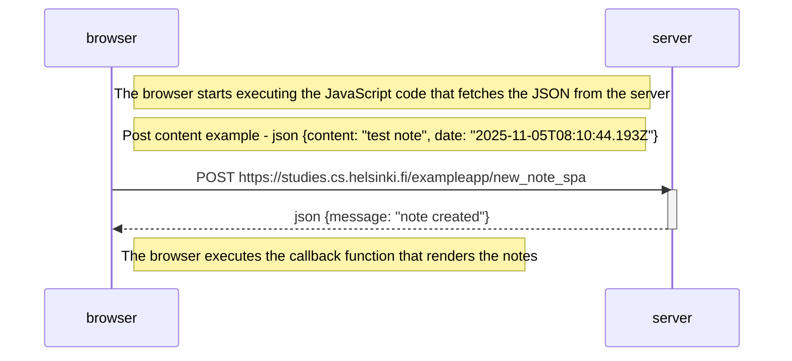

```mermaid
sequenceDiagram
    participant browser
    participant server

    Note right of browser: The browser starts executing the JavaScript code that fetches the JSON from the server

    Note right of browser: Post content example - json {content: "test note", date: "2025-11-05T08:10:44.193Z"} 

    browser->>server: POST https://studies.cs.helsinki.fi/exampleapp/new_note_spa
    activate server
    server-->>browser: json {message: "note created"}
    deactivate server

    Note right of browser: The browser executes the callback function that renders the notes
```